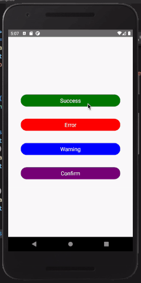

# react-native-alert-dialogues


A simple and fully customisable React Native component that shows success,error,warning and confirmation alerts.



## Features

* Easy to use
* Consistent look and feel on iOS and Android
* Can show success alert dialogues
* Can show error alert dialogues
* Can show warning alert dialogues
* Can show confirmation alert dialogues
* Customisable UI

## Installation

```bash
npm install --save react-native-alert-dialogues
OR
yarn add npm i react-native-alert-dialogues
```

## Usage
```bash
Just put the Alert tag before the last closing tag of the component
```
```javascript
import React, { Component } from 'react';
import {View} from 'react-native';
import {Alert} from 'react-native-alert-dialogues';

class Example extends Component {
  render() {
    return (
      <View>
      <Alert
          visible={this.state.showAlert}
          type= "success"
          okPressed={() =>
            this.setState({
              showAlert: false,
            })
          }
          message= "Message to show."
        />
        </View>
    );
  }
}
```

## Common properties

 name               | description                   | type     | Values
:------------------ |:----------------------------- | --------:|:---------------------------------------------
 type               | Type of alert to show         |  String  |'error','success','confirm,'loader','warning'
 visible            | Visible state of the alert    |  Boolean | true or false
 title              | Title of alert                |  String  | Any String Value
 message            | Message of alert              |  String  | Any String Value
 opacity            | Background opacity of dialogue|  Number  | between 0.0 - 1.0
 buttonTitlte       | Title of button in alert      |  String  | Any String Value
 okTitle            | Title of +ve button           |  String  | Any String Value
 cancelTitle        | Title of cancel button        |  String  | Any String Value
 cancelTitle        | Title of cancel button        |  String  | Any String Value
 hideIcon           | Hide the icon in alert        |  Boolean | true or false

 
## Callbacks

 name               | description                                             | type     | Values
:------------------ |:------------------------------------------------------- | --------:|:-------------
 okPressed          | Callback function on ok press                           | function | function
 confirmed          | Callback function on confirm press (confirmation alert) | function | function
 cancelled          | Callback function on cancel press (confirmation alert)  | function | function

## Example

```bash
git clone https://github.com/Ali-Haider-Ch/react-native-alert-dialogues
cd react-native-alert-dialogues/examples
npm install
npm run ios # or npm run android
```

## Copyright and License

MIT License

Copyright 2020-2022 Ali Hayder. All rights reserved.
